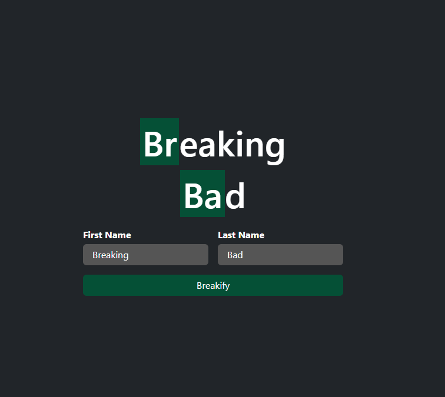

# React Challenge

Welcome to the React Challenge application! This project is designed to demonstrate a React-based system, fully equipped to run in both development and production environments using Docker. For a live demo, visit our GitHub Pages site:

🌐 [React Challenge Live Demo](https://mwb0.github.io/react-challenge)

## System Specifications

This application is built with React, a powerful JavaScript library for building user interfaces. It supports running in two different environments: development and production, with easy deployment using Docker Compose.

### Development Environment

- **Port:** The development environment runs on port 3000.
- **Environment Variable:** `REACT_APP_ENVIRONMENT=dev` to signify the development mode.

### Production Environment

- **Port:** The production environment is set up to run on port 80, making it readily accessible.
- **Environment Variable:** `REACT_APP_ENVIRONMENT=prod` for production mode.

## Running the Application

### Locally (Without Docker)

To run the application locally without Docker, follow these steps:

1. Install dependencies:

> npm install

2. Start the application:

> npm start

This will serve the application on `http://localhost:3000`.

### Using Docker

#### Development

To run the application in a Docker container for development:

1. Ensure Docker and Docker Compose are installed on your system.
2. Use the following command to build and run the container:
   
> docker-compose up --build

This utilizes `docker-compose.yml` for setting up the development environment.

#### Production

For production deployment with Docker:

1. Use the production Docker Compose file to build and run the container:

> docker-compose -f docker-compose.yml -f docker-compose.prod.yml up --build

This sets up the application to run in production mode, available on `http://localhost` (port 80).

This README provides a comprehensive guide for users to understand how to run and deploy your React application, both locally and with Docker, highlighting the difference in port usage between development and production environments.
